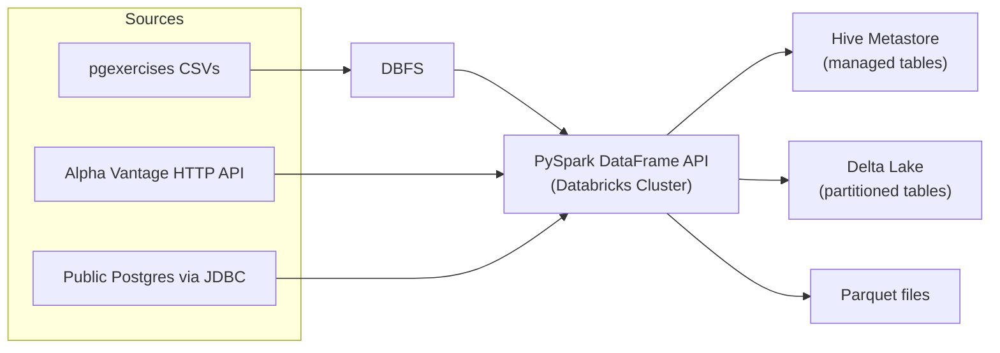
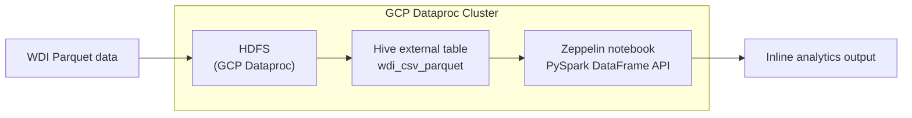

# PySpark Analytics: Databricks vs. Zeppelin/Hadoop

## Introduction

Data engineering teams routinely have to pick between managed and self-managed platforms when standing up Spark workloads, and each option comes with a different balance of setup effort, operational control, and day-to-day developer experience. This project set out to work through the same category of problem — batch ingestion, transformation, and aggregation on tabular data — on two different ends of that spectrum: a fully managed Databricks workspace, and a self-managed Hadoop cluster on GCP Dataproc running Apache Zeppelin. The goal was to get hands-on with the PySpark DataFrame API in both environments and be able to speak to the practical differences between them.

On the Databricks side, the work covers CSV ingestion with explicit schemas, DataFrame-based joins/aggregations/string-date manipulation, and a small multi-format ETL suite (Parquet, partitioned Delta, HTTP API ingestion, and JDBC extraction). On the Zeppelin side, the work covers importing and completing a Spark notebook against a Hive-backed dataset running on a Hadoop cluster provisioned through GCP Dataproc.

**Technologies used:** PySpark (Structured/DataFrame API), Databricks, DBFS, Hive Metastore, Delta Lake, Parquet, GCP Dataproc, HDFS, Apache Zeppelin, HTTP/REST APIs, JDBC.

## Databricks and Hadoop Implementation

**Dataset and analytics work.** This implementation uses the [pgexercises](https://pgexercises.com/) dataset — three tables (`bookings`, `facilities`, `members`) representing a fictional sports club. Work here spans three notebooks:

- [`0 - ETL pgexercises CSV files.ipynb`](./notebooks/0%20-%20ETL%20pgexercises%20CSV%20files.ipynb) — ingests the raw CSVs into managed Delta tables using explicit `StructType` schemas.
- [`1 - Spark Dataframe Data Manipulation (pgexercises).ipynb`](./notebooks/1%20-%20Spark%20Dataframe%20Data%20Manipulation%20%28pgexercises%29.ipynb) — 17 exercises across joins, aggregations, and string/date manipulation, all solved with the DataFrame API rather than raw SQL.
- [`2 - Spark ETL Jobs.ipynb`](./notebooks/2%20-%20Spark%20ETL%20Jobs.ipynb) — four ETL jobs covering Parquet round-tripping, partitioned Delta writes, HTTP API ingestion (stock ticker data with rate limiting), and JDBC extraction from a public Postgres instance.

**Architecture.** Source CSVs land in DBFS and are read with PySpark using predefined schemas rather than inference, for reliability. Transformations run entirely through the DataFrame API and are registered as managed tables in the Databricks Hive Metastore, with Delta Lake used where partitioning or ACID writes matter. External data (HTTP APIs, JDBC sources) is pulled directly into the cluster's driver/executors and merged into the same table layer, keeping ingestion, transformation, and storage on a single managed platform.

## Zeppelin and Hadoop Implementation

**Dataset and analytics work.** This implementation uses the World Development Indicators (WDI) dataset — `year`, `countryName`, `countryCode`, `indicatorName`, `indicatorCode`, and `indicatorValue` — stored as Parquet and exposed as an external Hive table (`wdi_csv_parquet`). The analytics work itself lives in a Zeppelin notebook: [`Spark Dataframe - WDI Data Analytics.json`](./spark/notebook/Spark%20Dataframe%20-%20WDI%20Data%20Analytics.json), imported into Zeppelin and completed using the PySpark DataFrame API.

**Architecture.** A Hadoop cluster is provisioned through GCP Dataproc, which brings up HDFS, Hive, and Zeppelin together. The WDI Parquet data is uploaded to HDFS and registered as an external Hive table over that location. From the Zeppelin notebook (running on the Dataproc master node), PySpark reads the Hive table into a DataFrame and runs the analysis interactively, paragraph by paragraph, with results rendered inline in the notebook — a much more manual, infrastructure-aware setup than the managed Databricks path.

## Future Improvement

1. **Secrets management** — replace hardcoded/placeholder API keys and credentials (e.g. RapidAPI key, JDBC connection details) with a proper secrets manager (`dbutils.secrets` on Databricks, or GCP Secret Manager on Dataproc) across both implementations.
2. **Automated cluster provisioning** — script the GCP Dataproc cluster setup (Hadoop, Hive, Zeppelin) with Infrastructure-as-Code (e.g. Terraform) instead of manual SSH/CLI steps, so the environment is reproducible and version-controlled.
3. **CI-based notebook validation** — add automated tests (e.g. AST-level checks or notebook execution smoke tests) to catch issues like schema mismatches or bad string formatting before merging, extending the ad hoc validation used during development.
4. **Unify orchestration** — introduce a shared scheduler (e.g. Airflow or Databricks Workflows) to run and monitor both the Databricks and Zeppelin/Hadoop pipelines on a consistent cadence, rather than triggering notebooks manually.
5. **Cost and performance comparison** — capture cluster runtime, cost, and job duration metrics for equivalent workloads on both platforms to turn the qualitative comparison in this README into a data-backed recommendation.