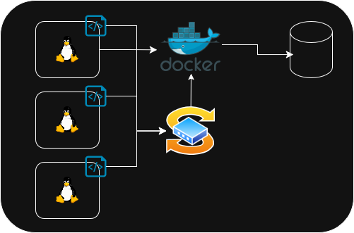

# Introduction
The following project is a Linux Cluster Monitoring system that records
the hardware specifications of a cluster of $n$ linux machines that communicate with 
each other through internal IPv4 Addresses

Data is gathered from each machine and stored
in a Relational PostgreSQL Database periodically to
manage future resource planning and report generation

# Quick Start
- start a psql instance using _psql_docker.sh_

```
# create postgresql docker instance
./scripts/psql_docker.sh create [db_username][db_password]

# start docker instance
./scripts/psql_docker.sh start
```
- Create Tables data tables

```psql -h localhost -U postgres -d host_agent -f sql/ddl.sql```
- Insert Hardware specs data into the DB using host_info.sh \
```./scripts/host_info.sh psql_host psql_port db_name psql_user psql_password```
- Insert Hardware usage data into the DB using host_usage.sj \
```./scripts/host_info.sh psql_host psql_port db_name psql_user psql_password```
- crontab setup 
```
bash> crontab -e
* * * * * bash /home/rocky/dev/jarvis_data_eng_SalahSalah
/projects/linux_sql/scripts/host_usage.sh 
localhost 5432 host_agent postgres password > /tmp/host_usage.log

*esc* :ws 
# check crontab log
ls /tmp/*log
cat /tmp/host_usage.log

#validate from psql instance
> SELECT * FROM 'host_usage';
```
# Implementation

## Architecture

## Scripts
- `psql_docker.sh` Creates and starts docker instance with postgres 9,6 image
- `host_info.sh` Parses hardware specification data with bash commands and inserts relevant data
- `host_usage.sh` Parses server usage data and inserts into psql database
- `crontab` deployment of automated `host_usage.sh` to fetch data continuously (every minute)

## Database Modeling
- `host_info`

  | Key              | Type     |
  |------------------|----------|
  | id               | INT      |
  | hostname         | STRING   |
  | cpu_number       | INT      |
  | cpu_architecture | STRING   |
  | cpu_model        | STRING   |
  | cpu_mhz          | FLOAT    |
  | l2_cache         | INT      | 
  | total_mem        | INT      |
  | timestamp        | DATETIME |

- `host_usage`

  | Key           | Type     |
    |---------------|----------|
  | timestamp     | DATETIME |
  | host_id       | INT      |
  | memory_free   | INT      |
  | cpu_idle      | STRING   |
  | cpu_kernel    | STRING   |
  | disk_io       | FLOAT    |
  | disk_available | INT      | 

# Improvements
- Data Collection Improvement: collect more data metrics i.e temperature, network
- Alerting for high usage or unused active hosts
- visualization or reporting features
