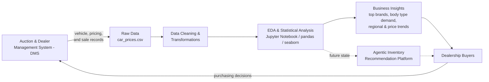

  # Vehicle Sales Data Analytics — Jarvis Auto Group

## Introduction

Jarvis Auto Group is a multi-dealership auto group that buys vehicles at auction to stock its lots. Right now those buying decisions lean heavily on individual buyers' experience and gut feel: which makes and models to bid on, how much to pay relative to market value, and which body types to stock up on. That approach has two costly side effects inventory that doesn't match what customers are actually buying, and unsold stock that sits on the lot depreciating every month it isn't sold.

This project builds the analytics foundation to fix that. Using historical auction sales data (vehicle details, sale price, and market value estimates), the notebook identifies which brands and body types actually move, where regional demand and pricing differ, and how selling price compares to market value (MMR) across vehicle segments. The goal is to give Jarvis Auto Group's buyers a data-backed answer to three questions: **what to buy** (highest-demand vehicles), **what to avoid** (slow-moving stock), and **when to act** (demand shifts, before they cost the business money). This analysis is also the first step toward an agentic recommendation platform that would eventually automate and scale these purchasing recommendations across dealerships.

**Work and technologies used:**
- **Python** for data wrangling and analysis, primarily with **pandas** and **NumPy**
- **Jupyter Notebook** as the environment for iterative, documented analysis
- **Matplotlib** and **Seaborn** for charting (brand volume, body type trends, geographic and time-series analysis, correlation heatmaps)
- Standard data cleaning practices: type casting (sale dates), null handling (backfilling transmission/body by make and model, dropping remaining nulls), numerical and categorical outlier removal, and derived features (vehicle age, sale year/month, price vs. MMR, price ratio)

## Implementation

### Project Architecture

Vehicle and sale data originates from auction and dealer management systems and is loaded as a flat file for analysis. From there, the notebook cleans and transforms the raw data, runs exploratory and statistical analysis, and produces the business insights described below. Today those insights inform buyers directly; the intended future state is to feed this same cleaned data into an agentic layer that combines market data with dealership inventory data to output ranked, reasoned purchase recommendations automatically.

### Data Analytics and Wrangling

The full analysis is available in [`Vehicle_Sales_Data.ipynb`](./Vehicle_Sales_Data.ipynb).

The notebook covers:
- Loading and profiling ~560K vehicle auction records (16 columns: make, model, body type, condition, odometer, MMR, selling price, sale date, etc.)
- Data quality handling: parsing sale dates, backfilling missing transmission/body values by make and model, and dropping remaining nulls
- Outlier removal on both numerical fields (year, odometer, MMR, selling price) and categorical fields (low-volume makes/models)
- Derived features: vehicle age, sale year/month, and price vs. MMR (both as a dollar difference and a ratio)
- Categorical analysis of top makes by volume and market share
- Body type distribution and how it has shifted year over year
- Median selling price by make
- Geographic analysis of sales volume and pricing by state
- Time-series analysis of monthly sales volume and pricing trends
- Correlation analysis across price, age, odometer, condition, and MMR
- Average sales premium/discount relative to MMR by body type

**How Jarvis Auto Group can use this to grow revenue:**
- **Brand concentration** — the top 15 makes account for the large majority of sales volume. Buyers can prioritize auction spend on these core brands instead of spreading budget thinly across long-tail makes that rarely sell.
- **Body type shift** — demand is moving away from sedans toward SUVs, minivans, and other utility-focused body types. Shifting the buying mix toward these growing segments, and away from sedans, aligns inventory with what customers are actually choosing.
- **Regional sourcing** — sales volume and pricing vary meaningfully by state (e.g., high-volume markets like Florida and California vs. higher-price luxury markets like Tennessee and Colorado). Sourcing decisions can be tuned by region: chase volume in the biggest markets, and target higher-value inventory where luxury demand and pricing support it.
- **Price vs. MMR by body type** — some body types (minivans, SUVs) sell closest to market value, while sedans sell at the largest discount to MMR, signaling faster depreciation and weaker demand. Buyers can favor vehicles that hold value best relative to MMR to protect margin on the lot.
- **Seasonality** — monthly sales volume and pricing trends reveal predictable seasonal dips and peaks, which can inform *when* to buy inventory ahead of demand rather than reacting after a slow month.

## Improvements

If given more time, the following would be the next priorities:

1. **Build the agentic inventory recommendation platform** — take the manual analysis in this notebook and turn it into the agent-based system outlined in the presentation: an agent that ingests live market and DMS data and outputs ranked, reasoned purchase recommendations with validation and constraints, rather than a one-off notebook report.
2. **Real-time pricing optimization** — extend the price-vs-MMR analysis into a live model that flags underpriced or overpriced inventory as auction listings come in, instead of a retrospective monthly view.
3. **Automated, refreshable data pipeline** — replace the static CSV load with a scheduled pipeline that pulls fresh data directly from the DMS/auction sources, re-runs the cleaning and analysis automatically, and keeps insights current without a manual notebook re-run.
